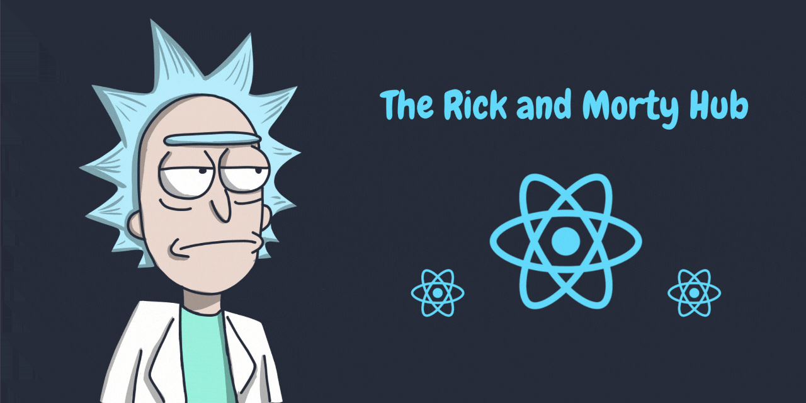

# 🌌 The Rick and Morty Hub



Un'applicazione web interattiva che ti permette di esplorare i personaggi dell'universo di Rick and Morty, creata con React.

## 🖥️ Demo
[Visualizza demo live](https://the-rick-and-morty-hub.vercel.app/)

## 🚀 Caratteristiche
- **Visualizzazione dei personaggi** in una griglia responsive
- **Ricerca per nome** con aggiornamento in tempo reale
- **Visualizzazione dettagliata** con informazioni su ogni personaggio:
  - Status (vivo, morto, sconosciuto)
  - Specie
  - Origine
  - Ultima posizione conosciuta
  - Genere
- **Navigazione paginata** tra tutti i personaggi dell'API
- **Effetti visivi e animazioni** a tema Rick and Morty
- **Design responsive** per dispositivi mobile e desktop

## 🛠️ Tecnologie Utilizzate
- **Frontend**: React.js 19.0.0
- **UI**: CSS personalizzato e Bulma 1.0.3
- **API**: [Rick and Morty API](https://rickandmortyapi.com/)

## 💻 Installazione

Clona il repository e installa le dipendenze:

```bash
git clone https://github.com/username/therickandmortyhub.git
cd therickandmortyhub
npm install
```

## 🚀 Utilizzo

Per avviare l'applicazione in modalità sviluppo:

```bash
npm start
```

L'applicazione sarà accessibile all'indirizzo [http://localhost:3000](http://localhost:3000).

Per creare una build di produzione:

```bash
npm run build
```

## 🔌 API

Questa applicazione utilizza la [Rick and Morty API](https://rickandmortyapi.com/), una API RESTful gratuita che fornisce dati sui personaggi, episodi e luoghi dell'universo di Rick and Morty.

### Esempi di endpoint:
- `GET /api/character` - Ottiene tutti i personaggi
- `GET /api/character/{id}` - Ottiene un personaggio specifico per ID
- `GET /api/character/?name=rick` - Cerca personaggi per nome

## 📁 Struttura del Progetto

```
src/
├── components/        # Componenti React
│   ├── CharacterCard.js
│   ├── CharacterList.js
│   └── Header.js
├── services/          # Servizi API
│   └── api.js
├── styles/            # Fogli di stile CSS
│   ├── CharacterCard.css
│   ├── CharacterList.css
│   └── Header.css
├── App.js             # Componente principale
└── index.js           # Punto di ingresso
```

## 👤 Autore
Progetto demo creato da [Henry](https://github.com/henry8913) per scopi didattici.

## 📝 Licenza
Questo progetto è distribuito con licenza [MIT](https://github.com/henry8913/TheRickAndMortyHub/blob/main/LICENSE.txt). Consulta il file LICENSE per maggiori informazioni.

---

